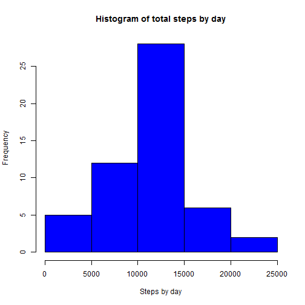
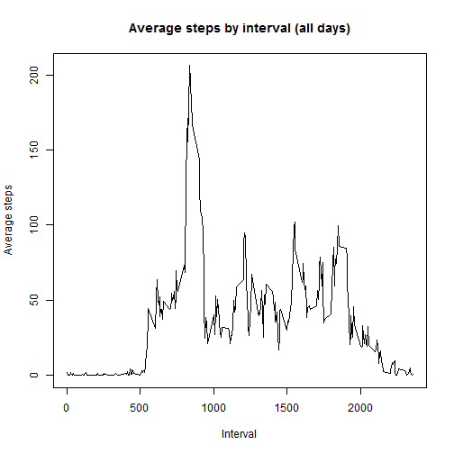
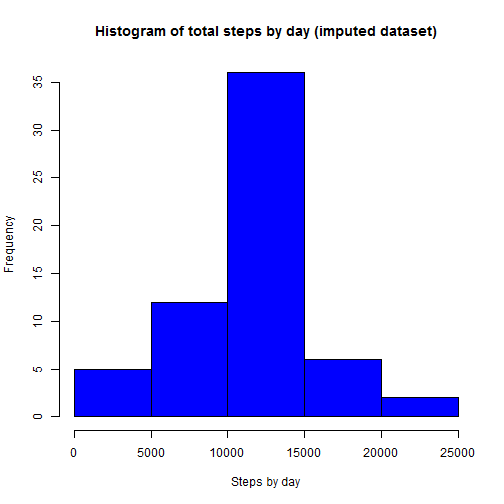
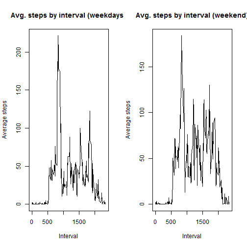

#Peer assessment 1 - Reproducible Research

This is an R Markdown document for the Peer Assessment 1 of the course Reproducible Research (at Coursera). This document integrates the commands and (once compiled using knitr) the results required. I use the base plotting system.vcf q1kkk,l   

##Loading and preprocessing the data

###Loading the data

It is assumed that:

- You are running this markdown document from the working directory where the data is stored  
- The data is already unzipped

The following code loads the data:


```r
data <- read.csv("activity.csv")
```


###Preprocessing the data

The following code transform the second column of the data frame into objects of class *Date*:


```r
data$date <- as.Date(data$date)
```


##Mean total number of steps taken per day

For this section the NA values are ignored. For this reason, a new dataset (ignoring NA values) is constructed, using the following R code:


```r
datacomplete <- data[complete.cases(data),]
```

###Total number of steps taken per day

The answer for this question is stored in the data frame totalstepsbyday. To visualize the answer the first rows of this data frame are printed out. 

The following R code answer the question:


```r
datacomplete <- data[complete.cases(data),]
totalstepsperday <- aggregate(datacomplete[, 1], list(datacomplete$date), sum)
colnames(totalstepsperday) <- c("date","total.steps")
head(totalstepsperday)
```

```
##         date total.steps
## 1 2012-10-02         126
## 2 2012-10-03       11352
## 3 2012-10-04       12116
## 4 2012-10-05       13294
## 5 2012-10-06       15420
## 6 2012-10-07       11015
```

###Histogram of total number of steps taken per day

The following R code constructs the histogram of the total number of steps taken each day:


```r
hist(totalstepsperday[,2], col = "blue", main = "Histogram of total steps by day", xlab = "Steps by day")
```

 


###Mean and median of the total number of steps taken per day

The answers for this question are computed in the following R code:


```r
meanstepsperday <- mean(totalstepsperday$total.steps)
paste0("The mean of the total number of steps taken per day is ",meanstepsperday)
```

```
## [1] "The mean of the total number of steps taken per day is 10766.1886792453"
```

```r
medianstepsperday <- median(totalstepsperday$total.steps)
paste0("The median of the total number of steps taken per day is ",medianstepsperday)
```

```
## [1] "The median of the total number of steps taken per day is 10765"
```


##Average daily activity pattern

###Time series plot

The following R code constructs a time series plot (i.e. type = "l") of the 5-minute interval (x-axis) and the average number of steps taken, averaged across all days (y-axis):


```r
averagesteps <- aggregate(datacomplete[, 1], list(datacomplete$interval), mean)
colnames(averagesteps) <- c("interval","average.steps")
plot(averagesteps[,1], averagesteps[,2], type = "l", main = "Average steps by interval (all days)", xlab = "Interval", ylab= "Average steps")
```

 


###5-minute interval with the maximum number of steps

The following R code answer that question, searching for the maximum average number of steps and then providing the interval at which it occurs:


```r
intervalformaxaveragesteps <- averagesteps[which.max(averagesteps[,2]),1]
paste0("The maximum average number of steps occurs at interval ",intervalformaxaveragesteps)
```

```
## [1] "The maximum average number of steps occurs at interval 835"
```

##Imputing missing values

###Total number of missing values in the dataset

The following R code answer the question:


```r
totalna <- sum(is.na(data$steps))
paste0("The total number of missing values in the dataset is ",totalna)
```

```
## [1] "The total number of missing values in the dataset is 2304"
```

###Strategy for filling in all of the missing values in the dataset

I have decided to use the mean of the respective 5-minute interval. The mean of every 5-minute interval is stored in the variable *averagesteps*, computed above.

###New dataset, equal to the original dataset but with the missing data filled in

The following R code implements a for-cycle, which evaluates if the number of steps in a given interval/date is a missing value. If that is the case, it fills the information with the mean of the respective 5-minute interval computed with the remaining complete data set. To check the answer easily the first rows of the new data set are printed out:


```r
imputedvalues <- data[,1]
for (i in 1: nrow(data)) {
  if (is.na(imputedvalues[i])){
    imputedvalues[i] <- averagesteps[match(data[i,3],averagesteps$interval),2]
  }
}
datafilled <- data
datafilled$steps <- imputedvalues
head(datafilled)
```

```
##       steps       date interval
## 1 1.7169811 2012-10-01        0
## 2 0.3396226 2012-10-01        5
## 3 0.1320755 2012-10-01       10
## 4 0.1509434 2012-10-01       15
## 5 0.0754717 2012-10-01       20
## 6 2.0943396 2012-10-01       25
```

###Histogram of the total number of steps taken each day 

The following R code computes the histogram using the imputed data set:


```r
totalstepsperdayimputed <- aggregate(datafilled[, 1], list(datafilled$date), sum)
colnames(totalstepsperdayimputed) <- c("date","total.steps")
hist(totalstepsperdayimputed[,2], col = "blue", main = "Histogram of total steps by day (imputed dataset)", xlab = "Steps by day")
```

 

###Mean and median of total number of steps per day (imputed data set)

The following R code computes the mean and median of the total number of steps taken per day using the imputed data set:


```r
meanstepsperdayimputed <- mean(totalstepsperdayimputed$total.steps)
paste0("The mean of the total number of steps taken per day in the imputed file is ",meanstepsperdayimputed)
```

```
## [1] "The mean of the total number of steps taken per day in the imputed file is 10766.1886792453"
```

```r
medianstepsperdayimputed <- median(totalstepsperdayimputed$total.steps)
paste0("The median of the total number of steps taken per day in the imputed file is ",medianstepsperdayimputed)
```

```
## [1] "The median of the total number of steps taken per day in the imputed file is 10766.1886792453"
```


These values are very similar to the estimates computed in the first part of the assignment (without NA values). There is a slight variation in the mean (about +0.4 with respect the not-imputed data set) and a bigger variation in the median (about +1.188). The original median was an integer, whereas the median for the imputed data set is a real number.

A closer examination of the data (not explicity reported here) shows that there are 8 days with no information, i.e. all its values are NA. Other than that, the imputation seems to have very little effect on the estimated quantities.

##Differences in activity patterns weekdays vs. weekends

This section uses the imputed data set.

###Data frame with *weekday* and *weekend* identification

The following R code creates a new data frame with information about the nature (*weekday* or *weekend*) of every day in the sample. I use spanish words to identify the days of the week, since spanish is my first language and my R version is set up in spanish as well. This section uses the library *plyr*. For illustration purposes, the first rows of the new data frame are printed out:


```r
nameday <- weekdays(datafilled$date)
keywords <- "lunes|martes|miércoles|jueves|viernes"
typeofday <- grepl(keywords,nameday)
typeofday <- as.factor(typeofday)
library("plyr")
typeofday <- revalue(typeofday, c("TRUE"="weekday", "FALSE"="weekend"))
datafilled <- cbind(datafilled,typeofday)
head(datafilled)
```

```
##       steps       date interval typeofday
## 1 1.7169811 2012-10-01        0   weekday
## 2 0.3396226 2012-10-01        5   weekday
## 3 0.1320755 2012-10-01       10   weekday
## 4 0.1509434 2012-10-01       15   weekday
## 5 0.0754717 2012-10-01       20   weekday
## 6 2.0943396 2012-10-01       25   weekday
```


###Panel plot 

The following code splits the original data frames in two, one for weekdays and one for weekends. It also computes the average number of steps for every 5-minute interval for both data frames:


```r
datafilledweekdays <- datafilled[datafilled$typeofday == "weekday", ]
datafilledweekend <- datafilled[datafilled$typeofday == "weekend", ]
averagestepsweekdays <- aggregate(datafilledweekdays[, 1], list(datafilledweekdays$interval), mean)
averagestepsweekend <- aggregate(datafilledweekend[, 1], list(datafilledweekend$interval), mean)
```

Finally, the following R code creates the panel plot required:


```r
par(mfrow=c(1, 2))
plot(averagestepsweekdays[,1], averagestepsweekdays[,2], type = "l", main = "Avg. steps by interval (weekdays)", xlab = "Interval", ylab= "Average steps")
plot(averagestepsweekend[,1], averagestepsweekend[,2], type = "l", main = "Avg. steps by interval (weekend)", xlab = "Interval", ylab= "Average steps")
```

 
